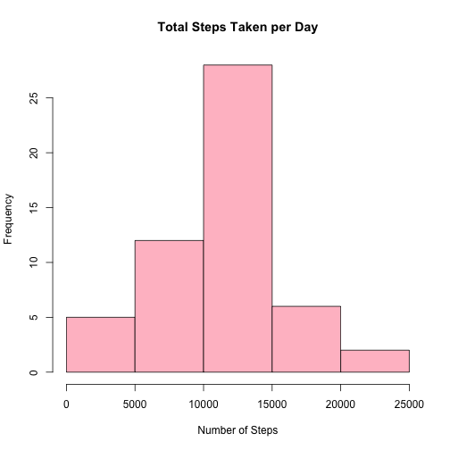
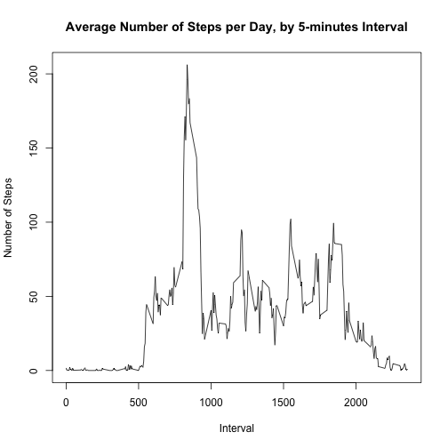
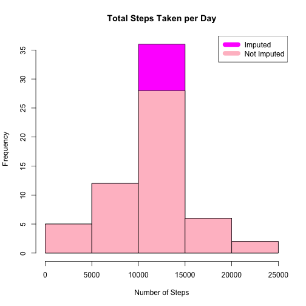
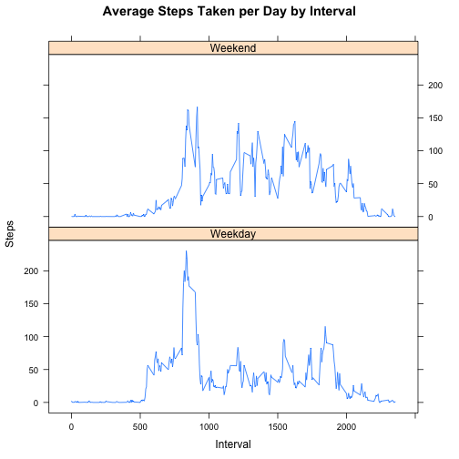

Reproducible Research: Project 1
============================
Anya Wichitwechkarn  
December 2016

## Data
Data used in this assignment was downloaded from the course website:  
- [Activity monitoring data](https://d396qusza40orc.cloudfront.net/repdata%2Fdata%2Factivity.zip)  
  

The variables included in this dataset are:  
- **steps**: Number of steps taking in a 5-minute interval (missing values coded as NA)  
- **date**: The date on which the measurement was taken in YYYY-MM-DD format  
- **interval**: Identifier for the 5-minute interval in which the measurement was taken  
  
The dataset is stored in a comma-separated-value (CSV) file and there are a total of 17,568 observations in this dataset.

## Loading and preprocessing the data
Download, unzip and read the data.


```r
url = "https://d396qusza40orc.cloudfront.net/repdata%2Fdata%2Factivity.zip"
download.file(url,destfile = "activity.zip",mode="wb")
unzip("activity.zip")

activity = read.csv("activity.csv", header=T,colClasses=c("integer","character","integer"), sep=",")
```

## What is mean total number of steps taken per day?
Create a histogram showing the total number of steps per day.

```r
steps_per_day <- aggregate(steps~ date,activity,sum)
hist(steps_per_day$steps, main = paste("Total Steps Taken per Day"), col="pink", xlab="Number of Steps")
```




```r
step_mean <- as.integer(mean(steps_per_day$steps))
step_median <- median(steps_per_day$steps)
```

The mean of the total number of steps is 10766 and  the median of the total number of steps is 10765.  

## What is the average daily activity pattern?
Create a time series plot of the 5-minute interval (x-axis) and the average number of steps taken, averaged across all days (y-axis).


```r
average_steps <- aggregate(steps ~ interval, activity, mean, na.rm=TRUE)
plot(average_steps$interval,average_steps$steps,type="l",xlab="Interval",ylab="Number of Steps",main="Average Number of Steps per Day, by 5-minutes Interval")
```




```r
max_interval <- average_steps[which.max(average_steps$steps),1]
max_step <- as.integer(average_steps[which.max(average_steps$steps),2])
```
The 5-minute interval with the maximum numver of steps averaged across all days is interval number 835, with 206 steps. 

## Imputing missing values

```r
total_na <- sum(is.na(activity$steps))
```
The total number of missing values in the dataset is 2304. 

Missing values were replaced by the average of total steps in their respective interval.

```r
imputed_na <- transform(activity, steps = ifelse(is.na(activity$steps),average_steps$steps[match(activity$interval,average_steps$interval)],activity$steps))
```

Recompute dataset and create comparison histrogram.

```r
new_steps_per_day <- aggregate(steps~date,imputed_na,sum)
hist(new_steps_per_day$steps,main = paste("Total Steps Taken per Day"),col="magenta",xlab="Number of Steps")

hist(steps_per_day$steps, main=paste("Total Steps Taken per Day"),col="pink",xlab="Number of Steps", add=T)
legend("topright",c("Imputed","Not Imputed"), col=c("magenta","pink"),lwd=10)
```



Calculate new mean and median, and determine differences with the original dataset.

```r
options(digits=2)
new_step_mean <- as.integer(mean(new_steps_per_day$steps))
new_step_median <- as.integer(median(new_steps_per_day$steps))
diff_mean <- new_step_mean - step_mean
diff_median <- new_step_median - step_median
diff_total_steps <- as.integer(sum(new_steps_per_day$steps) - sum(steps_per_day$steps))
```

- The mean for the imputed data is 10766.
- The difference between the mean of the imputed and original dataset is 0.
- The median for the imputed data is 10766.
- The difference between the median of the imputed and original dataset is 1.
- There are 86129 more steps in the imputed dataset than the original dataset. 


## Are there differences in activity patterns between weekdays and weekends?
The dataset with imputed missing values was used in this part of the assignment.  


```r
weekdays <- c("Monday","Tuesday","Wednesday","Thursday","Friday")

imputed_na$dow = as.factor(ifelse(is.element(weekdays(as.Date(imputed_na$date)),weekdays),"Weekday","Weekend"))

new_average_steps <- aggregate(steps ~ interval + dow,imputed_na,mean)

library(lattice)
xyplot(new_average_steps$steps ~ new_average_steps$interval | new_average_steps$dow, main="Average Steps Taken per Day by Interval", xlab="Interval",ylab="Steps",layout=c(1,2), type="l")
```


